# 📈 Tradely: Online Stock Trading Platform

[](https://nodejs.org/)
[](https://expressjs.com/)
[](https://react.dev/)
[](https://vite.dev/)
[](https://www.mongodb.com/atlas)
[](https://socket.io/)
[](https://razorpay.com/)
[](https://tailwindcss.com/)
[](https://www.docker.com/)
[](LICENSE)

**Tradely** is an institutional-grade, full-stack stock trading and cash management platform engineered with modern **React 19**, **Vite 8**, **Node.js**, **Express 5**, **MongoDB Atlas**, **Socket.IO**, and **Razorpay**. It delivers a high-performance trading terminal experience featuring real-time tick generation, multi-bracket risk management orders (Market, Limit, Stop-Loss, Trailing Stop, OCO), atomic balance reservations backed by MongoDB ACID multi-document transactions, private WebSocket execution notifications, a cryptographic payment gateway deposit engine, and a complete virtual cash withdrawal system with an authoritative ledger audit log.

Designed from the ground up for mission-critical reliability, Tradely combines low-latency execution simulation with strict financial accounting principles: zero double-spend states, atomic reservation locking, server-authoritative currency handling, idempotent webhook reconciliation, and multi-tenant security isolation.

> ⚠️ **Notice**: Tradely is a paper-trading simulation and portfolio management platform. It does not execute real-money transactions on live stock exchanges or connect to real banking payout rails.

---

## 🌐 Live Deployment

- 🔗 **Production Web Application:** [https://tradely-avishek.onrender.com](https://tradely-avishek.onrender.com)
- 🔗 **Production Trading Terminal:** [https://tradely-avishek-dashboard.onrender.com](https://tradely-avishek-dashboard.onrender.com)
- 🔗 **Production Backend API:** [https://tradely-avishek-backend.onrender.com](https://tradely-avishek-backend.onrender.com)

> ⚠️ **Note on Render Free Tier:** The backend and web services are hosted on Render's free compute tier, which spins down after periods of inactivity. The initial request or login may take 20–30 seconds while the container boots. Subsequent interactions execute at full speed.

---

## 🎯 Architectural Pillars

1. **ACID Multi-Document Transactions & Concurrency Safety**: All capital allocations, order placements, trade executions, deposits, and withdrawal reservations are executed inside atomic MongoDB sessions with transient write-conflict retries. The database guarantees zero negative balances and zero double-spend anomalies under high concurrency.
2. **Advanced Risk-Management Order Execution Engine**: Server-side tick evaluation supports 6 distinct order variants: instant `MARKET`, price-capped `LIMIT`, conditional `STOP_MARKET` and `STOP_LIMIT`, dynamic high-water-mark `TRAILING_STOP`, and dual-bracket `OCO` (One-Cancels-the-Other) orders sharing an atomic reservation pool.
3. **Dual-Channel Payment & Webhook Reconciliation**: Server-authoritative Razorpay order creation (strictly INR) paired with client-side HMAC SHA-256 signature verification (`POST /payments/verify`) and authoritative webhook reconciliation (`POST /webhooks/razorpay`). Both channels converge on a single idempotent balance credit handler. Invalid signatures never alter balance or prematurely terminate transactions.
4. **Institutional Cash Management & 4-Pillar Ledger**: Authoritative derivation of user capital across four distinct states:
   $$\text{Withdrawable Cash} = \text{Available Cash} - \text{Reserved for Trading} - \text{Pending Withdrawal}$$
   Every deposit, withdrawal, and ledger lifecycle event is recorded in a persistent `WalletTransaction` collection with full semantic filtering and user isolation.
5. **Real-Time Push Feeds & Private Notification Gateway**: In-memory market simulation broadcasting live price ticks over Socket.IO alongside private user-scoped rooms for instant order fills, trigger alerts, and cash ledger updates.
6. **Production-Hardened Security & Observability**: Strict Helmet security headers, configurable CORS origin whitelisting, sliding-window rate limiting on authentication routes, structured zero-dependency JSON logging with automated credential redaction, database-backed health/readiness probes, and multi-stage Alpine Docker deployment.

---

## 🏗️ System Architecture

Tradely cleanly separates public marketing, authenticated trading terminals, high-throughput REST APIs, and real-time WebSocket distribution into an enterprise-grade architecture:

### High-Level Topology

```text
                                  ┌──────────────────────────────────────────┐
                                  │            Client Browser                │
                                  ├────────────────────┬─────────────────────┤
                                  │ Frontend (Landing) │ Dashboard (Terminal)│
                                  │ React 19 + Vite 8  │ React 19 + Vite 8   │
                                  │ Public Discovery   │ Trading Terminal    │
                                  │ Auth Forms & Plans │ Charts, DOM & Funds │
                                  └─────────┬──────────┴──────────┬──────────┘
                                            │                     │
                                 HTTPS REST │          HTTPS REST │ & WSS (Socket.IO)
                                            ▼                     ▼
         ┌─────────────────────────────────────────────────────────────────────────────┐
         │                           Express 5.x Backend API                           │
         │                                                                             │
         │  - Trust Proxy Engine (Render SSL)     - HttpOnly / SameSite Auth Cookies   │
         │  - Helmet Security Headers             - In-Memory Sliding-Window RateLimit │
         │  - CORS Origin Firewall                - Request Logger & Credential Redact │
         │  - Centralized Error Handler           - Graceful Shutdown Controller       │
         └─────────────┬──────────────┬──────────────┬──────────────┬────────────┬─────┘
                       │              │              │              │            │
                       │ REST / Auth  │ Market Ticks │ Payments     │ Webhooks   │ Probes
                       ▼              ▼              ▼              ▼            ▼
        ┌─────────────────────┐ ┌──────────┐ ┌──────────────┐ ┌──────────┐ ┌────────────┐
        │    MongoDB Atlas    │ │ Socket.IO│ │ Razorpay API │ │ Razorpay │ │ /health    │
        │   Replica Set (ACID)│ │ Engine   │ │ Order Create │ │ Webhooks │ │ /ready     │
        │ Users, Orders, OCO  │ │ Ticker & │ │ Fetch Verify │ │ Signature│ │ Liveness & │
        │ Holdings, Ledger Tx │ │ Private  │ │ Test Gateway │ │ Dispatch │ │ Readiness  │
        └─────────────────────┘ └──────────┘ └──────────────┘ └──────────┘ └────────────┘
```

### Detailed Component Interaction

```text
+----------------------------------------------------------------------------------------------------+
| DASHBOARD TRADING TERMINAL (React 19 / Vite 8 / Tailwind CSS v4)                                   |
|                                                                                                    |
|  +--------------------+   +-----------------------+   +--------------------+   +----------------+  |
|  | Market Depth & DOM |   | Order Entry Form      |   | Funds & Ledger     |   | Live Chart.js  |  |
|  | Live Ticks (WSS)   |-->| Market, Limit, OCO    |-->| 4-Pillar Breakdown |-->| Real-Time P&L  |  |
|  | Watchlist Stream   |   | Atomic Pre-Check      |   | Razorpay & Withdraw|   | Asset Alloc.   |  |
|  +--------------------+   +-----------------------+   +--------------------+   +----------------+  |
+---------------------------------------|-------------------------|----------------------------------+
                                        |                         |
                             HTTPS REST |              WSS Events | (Market Data & Order Fills)
                                        v                         v
+----------------------------------------------------------------------------------------------------+
| BACKEND APPLICATION (Node.js / Express 5 / Socket.IO 4)                                            |
|                                                                                                    |
|  [Middleware Pipeline]                                                                             |
|  Helmet -> CORS -> Sliding-Window RateLimiter -> CookieParser -> JsonParser (1mb) -> AuthGuard     |
|                                                                                                    |
|  [REST Controllers & Dispatchers]                                                                  |
|  - orderController       (Order Creation, Cancel, OCO Group Brackets, Atomic Share Reservation)    |
|  - paymentController     (Razorpay Order Creation, HMAC SHA-256 Verification, Webhook Receiver)    |
|  - withdrawalController  (Virtual Withdrawal Initiation, Atomic Cash Reservation, Cancellation)    |
|  - fundController        (Authoritative Balance Fetching & Balance Reset Engine)                   |
|  - portfolioController   (Realized/Unrealized P&L, Asset Allocation Breakdown, Cost Basis)         |
|  - watchlistController   (User-Specific Watchlist Mutation via $addToSet / $pull)                  |
|  - marketDataController  (Public Snapshot Quotes & In-Memory Stock Price Queries)                  |
|  - authController        (HttpOnly Cookie Minting, Bcrypt Password Hash, Session Revocation)       |
|                                                                                                    |
|  [Core Services & Business Engines]                                                                |
|  - orderEngine.js        (Tick Matching, Limit Fills, Trailing-Stop Updates, OCO Mutual Cancel)    |
|  - paymentService.js     (Single Confirmation Path, Idempotent Credit, Gateway Failure Handler)    |
|  - withdrawalService.js  (Reservation Ledger, Async Simulated Processing, Failure Reversal)        |
|  - accountService.js     (4 Cash Pillars Engine: Available, Trading Lock, Pending, Withdrawable)   |
|  - marketSimulation.js   (Continuous In-Memory Geometric Brownian Motion Price Tick Generator)     |
+---------------------------------------|-------------------------|----------------------------------+
                                        |                         |
                       ACID Transaction |        External Gateway |
                                        v                         v
+-----------------------------------------------+        +-------------------------------------------+
| MONGODB ATLAS CLUSTER (Replica Set)           |        | THIRD-PARTY INFRASTRUCTURE                |
| - Users (Balance, Reserved, PendingWithdrawal)|        | - Razorpay Payment API (Order Creation)   |
| - Orders (Status, Type, Execution History)    |        | - Razorpay Webhooks (payment.captured)    |
| - OcoGroups (Parent Dual-Order Bracket Schema)|        | - Razorpay Webhooks (payment.failed)      |
| - Holdings (Aggregated Executed Positions)    |        |                                           |
| - WalletTransactions (Authoritative Ledger)   |        |                                           |
| - Watchlists (User Custom Symbol Sequences)   |        |                                           |
+-----------------------------------------------+        +-------------------------------------------+
```

---

## 🔄 End-to-End Core Lifecycles

### 1. Razorpay Deposit & Webhook Reconciliation Lifecycle

```text
User (Browser)                       Tradely Backend                      Razorpay Gateway
     │                                      │                                    │
     │── 1. Enter Amount (e.g. ₹10,000) ───>│                                    │
     │   POST /payments/create-order        │── 2. Enforce Server INR Currency   │
     │                                      │      orders.create({ amount }) ───>│
     │                                      │<─ 3. razorpay_order_id returned ───│
     │                                      │── 4. Create WalletTransaction      │
     │                                      │      (status: PAYMENT_PENDING)     │
     │<─ 5. Return orderId, key, amount ────│                                    │
     │                                      │                                    │
     │── 6. Open Razorpay Checkout Modal ───┼───────────────────────────────────>│
     │<─ 7. Payment Success (signature) ────┼────────────────────────────────────│
     │                                      │                                    │
     │── 8. POST /payments/verify ─────────>│                                    │
     │      { order_id, payment_id, sign }  │                                    │
     │                                      │── 9. Verify HMAC SHA-256 Signature │
     │                                      │      [If Invalid: 400 Bad Request, │
     │                                      │       leave as PAYMENT_PENDING]    │
     │                                      │                                    │
     │                                      │── 10. Atomic Multi-Doc Transaction │
     │                                      │       - Tx -> SUCCESS              │
     │                                      │       - User.balance += ₹10,000    │
     │<─ 11. 200 OK (Updated Funds) ────────│                                    │
     │                                      │                                    │
     │                                      │<─ 12. POST /webhooks/razorpay ─────│
     │                                      │       (payment.captured / failed)  │
     │                                      │── 13. Idempotent Double-Check      │
     │                                      │       (Skipped if already SUCCESS) │
```

### 2. Virtual Cash Withdrawal Lifecycle

```text
User (Trading Terminal)                     Tradely Backend API                 MongoDB Atlas
          │                                          │                                  │
          │── 1. Request ₹5,000 Withdrawal ─────────>│                                  │
          │   POST /withdrawals                      │── 2. Atomic Reservation Check    │
          │                                          │      Verify: Withdrawable >= 5K  │
          │                                          │── 3. Start ACID Session ────────>│
          │                                          │      - pendingWithdrawal += 5K   │
          │                                          │      - Create WalletTransaction  │
          │                                          │        (status: PENDING)         │
          │<─ 4. 201 Created (Withdrawal Record) ────│                                  │
          │                                          │                                  │
          │   [Optional User Cancellation]           │                                  │
          │── 5. POST /withdrawals/:id/cancel ──────>│── 6. Atomic Reversal ───────────>│
          │                                          │      - pendingWithdrawal -= 5K   │
          │                                          │      - Tx -> CANCELLED           │
          │<─ 7. 200 OK (Reservation Released) ──────│                                  │
          │                                          │                                  │
          │   [Simulated Processing Path]            │                                  │
          │                                          │── 8. Background Timer Transition │
          │                                          │      Tx: PENDING -> PROCESSING   │
          │                                          │                                  │
          │                                          │── 9. Terminal Completion ───────>│
          │                                          │      - User.balance -= ₹5,000    │
          │                                          │      - pendingWithdrawal -= 5K   │
          │                                          │      - Tx -> SUCCESS             │
          │                                          │   [On Failure: balance untouched,│
          │                                          │    pendingWithdrawal released]   │
```

### 3. Order Placement & Bracket Execution Lifecycle

```text
Trader (Terminal)                    Tradely Order Engine                MongoDB Replica Set
      │                                       │                                   │
      │── 1. Submit OCO Sell Bracket ────────>│                                   │
      │   (Target Limit + Stop Loss)          │── 2. Atomic ACID Reservation ────>│
      │                                       │      Lock User Shares in holding  │
      │                                       │      Create OcoGroup & 2 Orders   │
      │<─ 3. 201 Created (OCO Group Placed) ──│                                   │
      │                                       │                                   │
      │                                       │── 4. In-Memory Market Price Tick  │
      │                                       │      Evaluates Bid / Ask vs Stops │
      │                                       │                                   │
      │                                       │── 5. Target Limit Reached!        │
      │                                       │      - Order A -> EXECUTED        │
      │                                       │      - Order B -> CANCELLED       │
      │                                       │      - OcoGroup -> TRIGGERED      │
      │                                       │      - Settle Cash & Holdings ───>│
      │                                       │                                   │
      │<─ 6. Private Socket.IO Event ─────────│                                   │
      │   "order:filled" & "order:cancelled"  │                                   │
```

---

## ✨ Feature Deep-Dive

### 💰 1. Institutional Cash Management & Authoritative Ledger

- **The 4 Cash Pillars**:
  - **Available Cash**: Total liquid cash credited to the user's trading account.
  - **Reserved for Trading**: Capital locked in active, unfilled Buy orders.
  - **Pending Withdrawal**: Capital reserved for pending withdrawal dispatches.
  - **Withdrawable Cash**: Strictly calculated as $\text{Available} - \text{Reserved Trading} - \text{Pending Withdrawal}$.
- **Complete Cash Activity Audit Log**: Every deposit, withdrawal, and ledger lifecycle event is recorded in the `WalletTransaction` collection.
- **Semantic Type & Status Filtering**:
  - **Type Filter**: Filter instantly by `All`, `Deposits` (`DEPOSIT`), or `Withdrawals` (`WITHDRAWAL`).
  - **Status Filter**: Supports `All Statuses`, `Success` (`SUCCESS`), `Pending` (grouped match against `PENDING`, `CREATED`, and `PAYMENT_PENDING`), `Processing` (`PROCESSING`), `Failed` (`FAILED`), `Cancelled` (`CANCELLED`), and `Refunded` (`REFUNDED`).
- **Zero Real-Money Risk**: All balance numbers, withdrawals, and trading executions operate strictly within Tradely's simulated ledger environment.

### 💳 2. Razorpay Deposits & Cryptographic Payment Security

- **Server-Authoritative Orders**: Clients specify only `amount`. The server strictly enforces currency as `INR` and calls Razorpay's order creation API server-side.
- **HMAC SHA-256 Signature Verification**: In `POST /payments/verify`, signatures are verified via Node.js native `crypto.createHmac("sha256")` against the order ID and payment ID.
- **Strict Non-Terminal Failure Semantics**: Submitting an invalid verification signature returns HTTP 400 (`INVALID_PAYMENT_SIGNATURE`), never alters user balance, and **never** marks the transaction as `FAILED`. The transaction remains in `PAYMENT_PENDING`, allowing the user to retry or webhooks to reconcile.
- **Authoritative Gateway Failure Signals**: Transactions transition to `FAILED` exclusively upon receipt of verified gateway signals (such as Razorpay's `payment.failed` webhook).
- **Dual-Channel Convergence & Idempotency**: Both the verification endpoint and incoming webhooks delegate to a single atomic confirmation function. Repeated calls return 200 OK idempotently without double crediting.

### 🏦 3. Virtual Withdrawal System

- **Atomic Pre-Condition Checks**: Withdrawals cannot exceed current `withdrawableBalance`. The reservation is committed atomically to `pendingWithdrawalAmount` using MongoDB transactions.
- **Simulated Payout Pipeline**: Withdrawals cleanly transition across `PENDING` ➔ `PROCESSING` ➔ `SUCCESS`.
- **Cancellation Workflow**: Users can cancel any `PENDING` withdrawal with one click, releasing the reserved capital back into withdrawable cash.
- **Concurrency & In-Flight Protection**: Once a withdrawal moves to `PROCESSING`, cancellation is strictly rejected with HTTP 400 (`CANNOT_CANCEL_WITHDRAWAL`). Race conditions between simultaneous cancel requests and processing transitions are handled cleanly.
- **Failure Safety**: If a withdrawal transitions to `FAILED`, the pending reservation is atomically released back to available cash with zero balance deduction.

### 📊 4. Advanced Risk-Management Order Execution Engine

- **MARKET Orders**: Immediate execution against current simulated market quotes with instant balance/holding reconciliation.
- **LIMIT Orders**: Bid/ask price cap evaluation. Capital is atomically reserved at order placement and executed when price conditions are satisfied.
- **STOP_MARKET & STOP_LIMIT Orders**: Conditional orders triggered when market prices hit a specified stop threshold, transitioning to market or limit orders.
- **TRAILING_STOP Orders**: Dynamic trailing stop-loss that automatically adjusts its trigger price as market quotes hit new favorable high-water marks.
- **OCO (One-Cancels-the-Other) Brackets**: Dual-bracket orders linking a profit-taking limit order with a stop-loss order. If either order executes or is cancelled, the sibling order is atomically cancelled and reservations are claimed safely.

### 📈 5. Portfolio Analytics & Risk Metrics

- **Real-Time P&L Engine**: Realized gains/losses tracked across completed round-trip trades; unrealized gains/losses dynamically calculated against live price feeds.
- **Asset Allocation Breakdown**: Visual breakdown of portfolio exposure across individual equities and sectors.
- **Missing Quote Fallbacks**: Resilient calculation engines gracefully handle missing ticker quotes without NaN crashes or corrupted portfolio totals.

### ⭐ 6. Watchlist & Live Market Streaming

- **Persistent User Watchlists**: User-specific watchlists stored in MongoDB with atomic `$addToSet` and `$pull` operators preventing duplicate symbols.
- **Custom Symbol Sequence**: Supports custom drag-and-drop or rank-based reordering.
- **High-Frequency WebSocket Engine**: Real-time ticker generator emitting simulated geometric Brownian motion price updates to all connected dashboard terminals.

### 🔐 7. Authentication, Multi-Tenancy & Security

- **Stateless JWT in HttpOnly Cookies**: Tokens are stored exclusively in `HttpOnly`, `SameSite: Lax` (or `None` in cross-site HTTPS), `Secure` cookies. Never exposed to `localStorage` or JavaScript execution context.
- **Strict Multi-Tenant Isolation**: Every database query scopes transactions, orders, holdings, and watchlists strictly to the authenticated `req.user._id`. User A can never inspect or verify User B's orders or transactions.
- **Sliding-Window Rate Limiting**: Sensitive authentication routes (`/auth/signup`, `/auth/login`) are protected by an in-memory rate limiter (20 requests per 15 minutes per IP) with standard `RateLimit-*` and `Retry-After` headers.
- **Payload Sanitization & Error Masking**: 1 MB payload caps, Helmet security headers, and automated stack-trace suppression under `NODE_ENV=production`.

---

## 📷 Screenshots

### 1. Landing Page
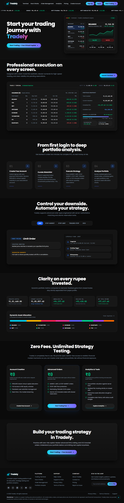

### 2. User Authentication (Login)
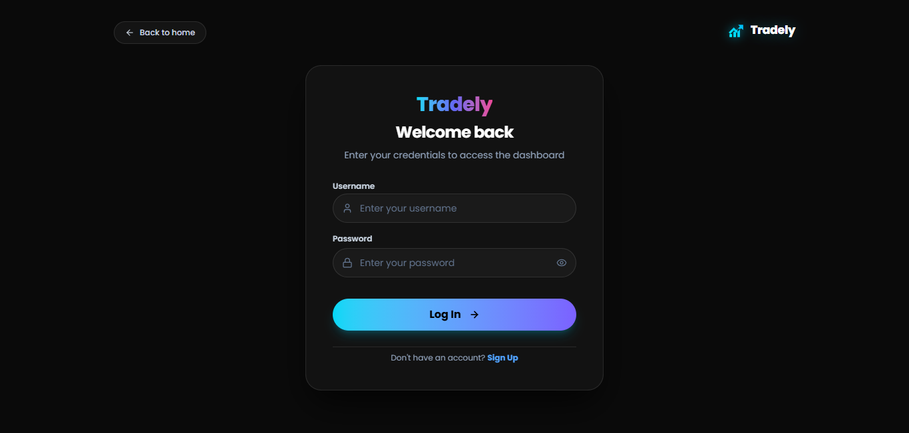

### 3. New Account Registration (Signup)
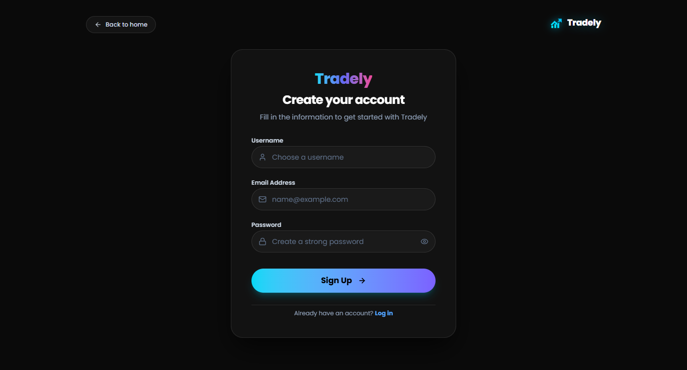

### 4. Trading Terminal Dashboard & Portfolio Summary
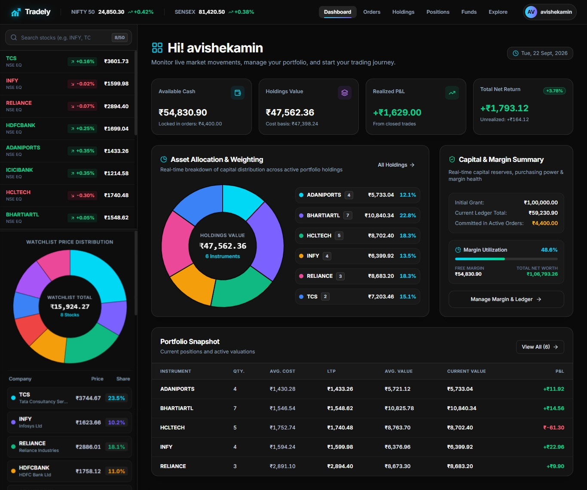

### 5. Market Exploration & Stock Discovery
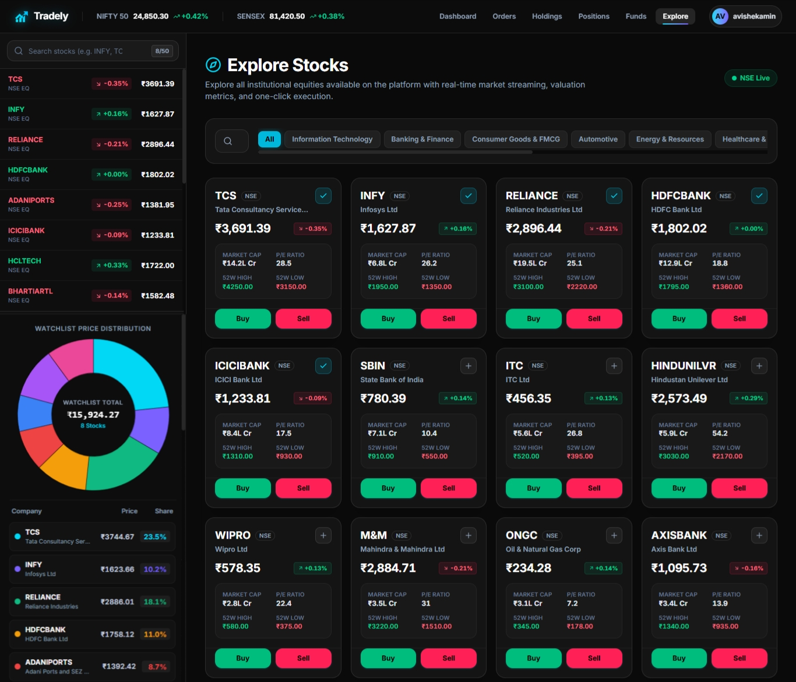

### 6. Settled Equity Holdings
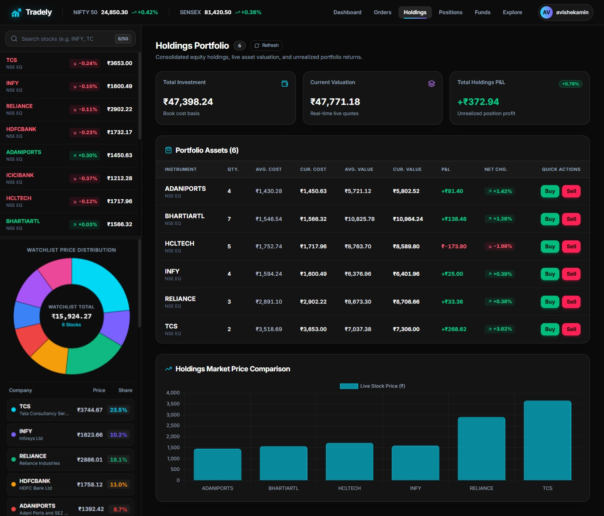

### 7. Open Positions & Intraday P&L
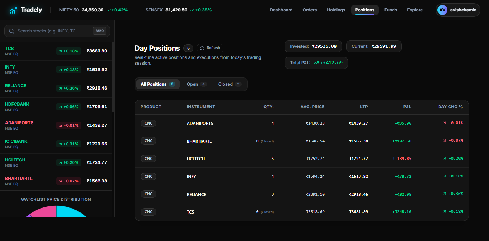

### 8. Order Book & Execution History
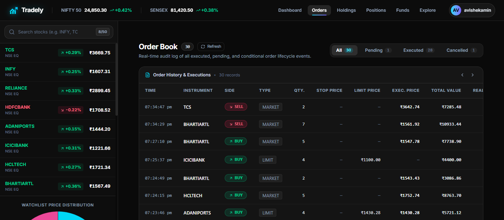

### 9. Buy Order Placement Window (Market, Limit, OCO)
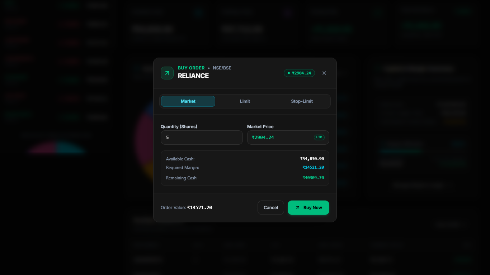

### 10. Sell Order Execution & Position Exit
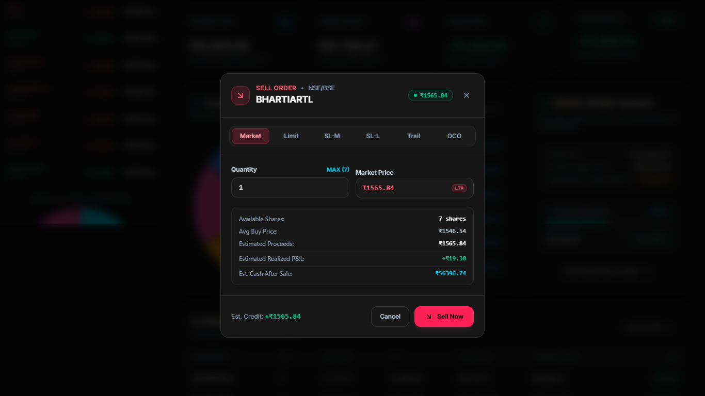

### 11. Funds Management & 4-Pillar Cash Ledger
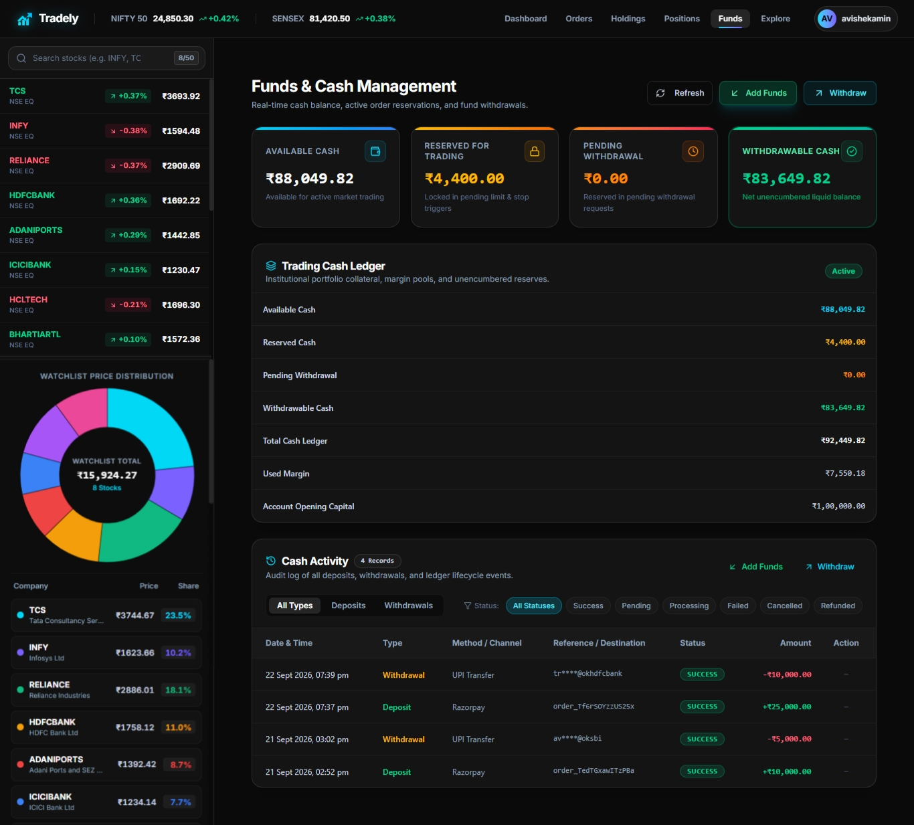

### 12. Add Funds via Razorpay Payment Gateway
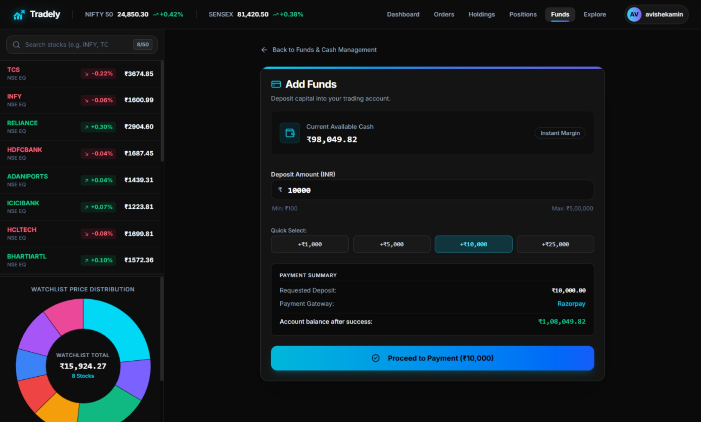

### 13. Cash Withdrawal Request
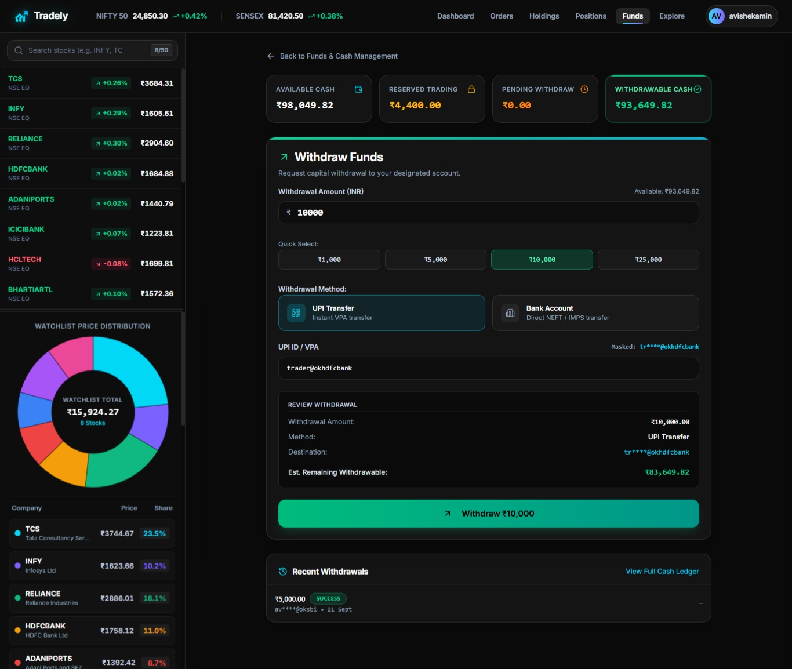

---

## 🚀 Tech Stack

### Frontend & Dashboard Architecture

- **Framework:** [React 19](https://react.dev/) + [Vite 8](https://vite.dev/) (Client Environment)
- **Routing:** [React Router 7](https://reactrouter.com/) (Protected Routes & Session Guarding)
- **Styling:** [Tailwind CSS v4](https://tailwindcss.com/) (`@tailwindcss/vite`)
- **Component Primitives:** [Radix UI](https://www.radix-ui.com/) (`@radix-ui/react-dialog`, `@radix-ui/react-dropdown-menu`, `@radix-ui/react-slot`, `@radix-ui/react-tooltip`)
- **Iconography:** [Lucide React](https://lucide.dev/)
- **Data Visualization:** [Chart.js 4](https://www.chartjs.org/) + [react-chartjs-2](https://react-chartjs-2.js.org/) (Interactive Doughnut Portfolio & Real-Time Price Sparklines)
- **HTTP Client:** [Axios](https://axios-http.com/) (Credentials-enabled REST client)
- **Real-Time Client:** [Socket.IO Client 4.8](https://socket.io/docs/v4/client-api/) (High-frequency live ticker streaming & private notifications)
- **UI Utilities:** `clsx`, `tailwind-merge`, `class-variance-authority`

### Backend Architecture

- **Runtime:** [Node.js v20+](https://nodejs.org/) (ES Modules)
- **Framework:** [Express.js 5.2](https://expressjs.com/) (Modern REST Routing with native async handling)
- **Real-Time Engine:** [Socket.IO 4.8](https://socket.io/) (Scoped private user rooms & in-memory market tick broadcast)
- **Database ODM:** [Mongoose 9.10](https://mongoosejs.com/) (ACID multi-document transactions & schema enforcement)
- **Authentication:** [jsonwebtoken 9.0](https://github.com/auth0/node-jsonwebtoken) (Stateless JWT in HttpOnly cookies) + [bcryptjs 3.0](https://github.com/dcodeIO/bcrypt.js) (Salted password hashing)
- **Security Middleware:** [Helmet 8](https://helmetjs.github.io/) (Security headers), Custom In-Memory Sliding-Window RateLimiter, [cookie-parser](https://github.com/expressjs/cookie-parser), [cors](https://github.com/expressjs/cors)
- **Observability:** Custom Zero-Dependency Structured JSON Logger (automated credential redaction) + Liveness & Readiness Probes (`/health`, `/ready`)

### Payment & Third-Party Services

- **Payment Gateway:** [Razorpay](https://razorpay.com/) (Server-authoritative order creation, HMAC SHA-256 signature verification & webhook reconciliation)

### Cloud Infrastructure & DevOps

- **Database Cluster:** [MongoDB Atlas](https://www.mongodb.com/atlas) (Replica Set with Multi-Document ACID Transactions)
- **Containerization:** [Docker](https://www.docker.com/) (Multi-stage Node.js & Alpine Nginx containers)
- **Container Orchestration:** [Docker Compose](https://docs.docker.com/compose/)
- **Reverse Proxy:** [Nginx Alpine](https://nginx.org/) (High-efficiency static asset caching & SPA routing)
- **Cloud Hosting:** [Render](https://render.com/) (Web Services & Reverse Proxy with SSL termination)
- **Continuous Integration:** [GitHub Actions](https://github.com/features/actions) (`.github/workflows/ci.yml` automated lint & test pipeline)

---

## 📁 Project Structure

```text
tradely/
├── backend/
│   ├── src/
│   │   ├── config/
│   │   │   ├── db.js                           # MongoDB connection & replica set initialization
│   │   │   └── env.js                          # Environment configuration & fail-fast validation
│   │   ├── controllers/
│   │   │   ├── authController.js               # User registration, login, logout & session inspection
│   │   │   ├── fundController.js               # 4-pillar cash balance retrieval & account reset engine
│   │   │   ├── healthController.js             # Liveness (/health) & MongoDB readiness (/ready) probes
│   │   │   ├── holdingController.js            # User equity holding queries & portfolio sync
│   │   │   ├── marketDataController.js         # Real-time quotes, symbol snapshots & price history
│   │   │   ├── orderController.js              # Order placement (Market, Limit, OCO) & cancellation
│   │   │   ├── paymentController.js            # Razorpay order creation, HMAC verification & history
│   │   │   ├── portfolioController.js          # P&L aggregation, asset allocation & risk metrics
│   │   │   ├── positionController.js           # Intraday & derivative positions retrieval
│   │   │   ├── watchlistController.js          # User watchlist items CRUD & sequence reordering
│   │   │   └── withdrawalController.js         # Virtual withdrawal requests, cancellation & history
│   │   ├── middleware/
│   │   │   ├── auth.js                         # Stateless JWT authentication guard & user hydration
│   │   │   ├── cors.js                         # Dynamic CORS configuration & origin whitelist
│   │   │   ├── errorHandler.js                 # Centralized error handler & production stack masking
│   │   │   ├── notFound.js                     # Standard 404 Route Not Found handler
│   │   │   ├── rateLimiter.js                  # In-memory sliding-window rate limiter for auth routes
│   │   │   └── requestLogger.js                # Zero-dependency JSON request logger with redaction
│   │   ├── models/
│   │   │   ├── HoldingsModel.js                # Settled equity holdings Mongoose model
│   │   │   ├── OcoGroupModel.js                # One-Cancels-the-Other parent bracket model
│   │   │   ├── OrdersModel.js                  # Trade orders Mongoose model
│   │   │   ├── PositionsModel.js               # Open positions Mongoose model
│   │   │   ├── UserModel.js                    # User credentials & 4-pillar balance fields
│   │   │   ├── WalletTransactionModel.js       # Authoritative ledger audit log model
│   │   │   └── WatchlistModel.js               # User-scoped symbol watchlist model
│   │   ├── routes/
│   │   │   ├── authRoutes.js                   # Authentication endpoints (/auth)
│   │   │   ├── fundRoutes.js                   # Capital breakdown & reset routes (/funds)
│   │   │   ├── healthRoutes.js                 # Health & readiness probe routes (/health, /ready)
│   │   │   ├── holdingRoutes.js                # Holdings endpoints (/allHoldings)
│   │   │   ├── index.js                        # Master router aggregator & mounting
│   │   │   ├── marketDataRoutes.js             # Market quotes & symbol endpoints (/market)
│   │   │   ├── orderRoutes.js                  # Order execution & cancellation routes
│   │   │   ├── paymentRoutes.js                # Razorpay order creation & verify (/payments)
│   │   │   ├── portfolioRoutes.js              # Portfolio analytics & P&L (/portfolio)
│   │   │   ├── positionRoutes.js               # Positions endpoints (/allPositions)
│   │   │   ├── watchlistRoutes.js              # Watchlist CRUD & reorder routes (/watchlist)
│   │   │   ├── webhookRoutes.js                # Authoritative Razorpay webhooks (/webhooks)
│   │   │   └── withdrawalRoutes.js             # Virtual cash withdrawal routes (/withdrawals)
│   │   ├── schemas/
│   │   │   ├── HoldingsSchema.js               # Schema for user holdings & cost basis
│   │   │   ├── OcoGroupSchema.js               # Schema for linked OCO bracket orders
│   │   │   ├── OrdersSchema.js                 # Schema for order types, triggers & execution states
│   │   │   ├── PositionsSchema.js              # Schema for open positions & realized P&L
│   │   │   ├── UserSchema.js                   # Schema for users, passwords & cash pillars
│   │   │   ├── WalletTransactionSchema.js      # Schema for authoritative cash ledger transactions
│   │   │   └── WatchlistSchema.js              # Schema for user custom symbol sequences
│   │   ├── services/
│   │   │   ├── accountService.js               # 4-pillar cash calculations & balance mutations
│   │   │   ├── authService.js                  # Password hashing, JWT token minting & validation
│   │   │   ├── holdingService.js               # Holding quantities & execution aggregation
│   │   │   ├── marketDataService.js            # Simulated price ticks & geometric Brownian motion
│   │   │   ├── orderLifecycleService.js        # Tick evaluation, limit fills & OCO mutual cancels
│   │   │   ├── paymentService.js               # Single confirmation path, HMAC verification & credits
│   │   │   ├── portfolioAnalyticsService.js    # Realized/unrealized P&L, allocation & fallbacks
│   │   │   ├── positionService.js              # Position aggregation & cost basis calculation
│   │   │   ├── razorpayService.js              # Server-authoritative Razorpay API client
│   │   │   ├── watchlistService.js             # Atomic watchlist additions, removals & reordering
│   │   │   └── withdrawalService.js            # Withdrawal reservation ledger & simulated pipeline
│   │   ├── utils/
│   │   │   ├── apiResponse.js                  # Standardized JSON response envelope helper
│   │   │   ├── AppError.js                     # Operational error class with HTTP status codes
│   │   │   ├── logger.js                       # Structured JSON logger with automated credential redaction
│   │   │   └── transactionHelper.js            # MongoDB session & retryable ACID transaction runner
│   │   ├── validators/
│   │   │   ├── authValidator.js                # Signup & login payload validation
│   │   │   ├── orderValidator.js               # Order type, side, quantity, price & OCO validation
│   │   │   ├── paymentValidator.js             # Deposit amount & signature payload validation
│   │   │   └── withdrawalValidator.js          # Withdrawal amount & destination payload validation
│   │   ├── app.js                              # Express application setup & middleware pipeline
│   │   ├── server.js                           # Server bootstrap, DB connection & graceful shutdown
│   │   └── socket.js                           # Socket.IO connection manager & private room router
│   ├── test/
│   │   ├── test_cash_ledger_semantics.js       # Cash ledger status filtering & payment semantics (46 tests)
│   │   ├── test_concurrency_and_edge_cases.js  # Concurrency races & manual edge-case flows (23 tests)
│   │   ├── test_payment_deposits.js            # Razorpay payment gateway integration test suite (51 tests)
│   │   ├── test_security_and_trading.js        # System security & core trading lifecycle test suite (58 tests)
│   │   └── test_virtual_withdrawals.js         # Virtual cash withdrawal system test suite (53 tests)
│   ├── Dockerfile                              # Multi-stage production Node.js container
│   ├── .env.example                            # Backend environment template
│   └── package.json                            # Backend scripts & runtime dependencies
│
├── dashboard/                                  # Authenticated Trading Terminal (React 19 / Vite 8)
│   ├── public/
│   │   └── favicon.svg                         # Terminal favicon asset
│   ├── src/
│   │   ├── components/
│   │   │   ├── ui/
│   │   │   │   ├── badge.jsx                   # Status badge primitive
│   │   │   │   ├── button.jsx                  # Interactive button primitive
│   │   │   │   ├── card.jsx                    # Card wrapper primitive
│   │   │   │   ├── dialog.jsx                  # Modal dialog primitive
│   │   │   │   ├── dropdown-menu.jsx           # Accessible dropdown menu primitive
│   │   │   │   ├── input.jsx                   # Form input primitive
│   │   │   │   ├── ToastContainer.jsx          # Notification toast container & trigger
│   │   │   │   └── tooltip.jsx                 # Accessible tooltip hover primitive
│   │   │   ├── BuyActionWindow.jsx             # Order placement window (Market, Limit, OCO)
│   │   │   ├── Dashboard.jsx                   # Main terminal view orchestrator
│   │   │   ├── DoughnutChart.jsx               # Portfolio asset allocation doughnut chart
│   │   │   ├── Explore.jsx                     # Market exploration & stock discovery widget
│   │   │   ├── Funds.jsx                       # 4-pillar cash balance display & ledger log
│   │   │   ├── GeneralContext.jsx              # Modal state & action window context
│   │   │   ├── Holdings.jsx                    # Settled equity holdings portfolio table
│   │   │   ├── Home.jsx                        # Terminal landing container
│   │   │   ├── Menu.jsx                        # Terminal navigation bar & user profile drawer
│   │   │   ├── Orders.jsx                      # Active orders & execution history view
│   │   │   ├── Positions.jsx                   # Open positions & intraday P&L view
│   │   │   ├── ProtectedRoute.jsx              # Session guard & authentication redirector
│   │   │   ├── SellActionWindow.jsx            # Sell order execution & share lock window
│   │   │   ├── Summary.jsx                     # Capital summary & quick action cards
│   │   │   ├── TopBar.jsx                      # Terminal top bar with live ticker & indices
│   │   │   ├── TradelyLogo.jsx                 # Vector brand logo component
│   │   │   ├── VerticalGraph.jsx               # Performance histogram visualizer
│   │   │   └── WatchList.jsx                   # Live-updating custom watchlist & DOM actions
│   │   ├── config/
│   │   │   └── api.js                          # Axios instance & dynamic environment base URL
│   │   ├── context/
│   │   │   ├── AuthContext.jsx                 # User session, login, logout & profile state
│   │   │   ├── MarketDataContext.jsx           # Socket.IO tick listener & price cache
│   │   │   └── ThemeContext.jsx                # Terminal dark/light aesthetic provider
│   │   ├── lib/
│   │   │   └── utils.js                        # Tailwind class merge & formatting helpers
│   │   ├── pages/
│   │   │   ├── PaymentPage.jsx                 # Razorpay deposit modal & checkout handler
│   │   │   └── WithdrawPage.jsx                # Virtual cash withdrawal request interface
│   │   ├── App.jsx                             # Terminal root component & view router
│   │   ├── index.css                           # Tailwind CSS directives & custom styles
│   │   └── main.jsx                            # Dashboard entry point
│   ├── Dockerfile                              # Multi-stage Vite build served via Nginx Alpine
│   ├── nginx.conf                              # Production Nginx reverse proxy configuration
│   ├── .env.example                            # Dashboard environment template
│   ├── package.json                            # Dashboard dependencies & scripts
│   └── vite.config.js                          # Vite build configuration
│
├── frontend/                                   # Public Landing & Discovery Application (React 19 / Vite 8)
│   ├── public/
│   │   └── favicon.svg                         # Public application favicon
│   ├── src/
│   │   ├── components/
│   │   │   └── ui/
│   │   │       ├── badge.jsx                   # UI badge primitive
│   │   │       ├── button.jsx                  # UI button primitive
│   │   │       ├── card.jsx                    # UI card primitive
│   │   │       ├── dropdown-menu.jsx           # UI dropdown menu primitive
│   │   │       ├── input.jsx                   # Form input primitive
│   │   │       ├── sheet.jsx                   # Side sheet drawer primitive
│   │   │       └── tooltip.jsx                 # Tooltip hover primitive
│   │   ├── config/
│   │   │   └── api.js                          # Backend API client configuration
│   │   ├── context/
│   │   │   └── AuthContext.jsx                 # Authentication state & session checks
│   │   ├── landing/
│   │   │   ├── about/
│   │   │   │   └── AboutPage.jsx               # About Tradely mission, vision & philosophy
│   │   │   ├── contact/
│   │   │   │   └── ContactPage.jsx             # User feedback & enterprise contact form
│   │   │   ├── help/
│   │   │   │   └── HelpPage.jsx                # FAQs, knowledge base & support guides
│   │   │   ├── home/
│   │   │   │   ├── AnalyticsSection.jsx        # Real-time portfolio analytics showcase
│   │   │   │   ├── FinalCtaSection.jsx         # Bottom conversion CTA banner
│   │   │   │   ├── HeroSection.jsx             # Hero banner with terminal CTA & stats
│   │   │   │   ├── HomePage.jsx                # Landing page master composition
│   │   │   │   ├── HowItWorksSection.jsx       # 3-step platform workflow explainer
│   │   │   │   ├── MarketTickerBar.jsx         # Continuous scrolling market ticker strip
│   │   │   │   ├── PricingSection.jsx          # Transparent fee structure & paper trading tier
│   │   │   │   ├── RiskManagementSection.jsx   # OCO, Stop-Loss & bracket order showcase
│   │   │   │   └── TerminalShowcaseSection.jsx # Interactive trading terminal UI preview
│   │   │   ├── login/
│   │   │   │   └── LoginPage.jsx               # User authentication & session initiation
│   │   │   ├── privacy/
│   │   │   │   └── PrivacyPage.jsx             # Data handling & privacy policies
│   │   │   ├── report/
│   │   │   │   └── ReportIssuePage.jsx         # Bug reporting & system diagnostic form
│   │   │   ├── signup/
│   │   │   │   └── SignUp.jsx                  # Account registration & initial capital setup
│   │   │   ├── support/
│   │   │   │   └── SupportPage.jsx             # Dedicated support & ticketing hub
│   │   │   ├── terms/
│   │   │   │   └── TermsOfServicePage.jsx      # Legal terms of service & simulated disclaimer
│   │   │   ├── BackToTop.jsx                   # Smooth scroll-to-top floating button
│   │   │   ├── Footer.jsx                      # Comprehensive footer with legal & page links
│   │   │   ├── Navbar.jsx                      # Top navigation bar with responsive drawer
│   │   │   ├── NotFound.jsx                    # 404 page with navigation redirects
│   │   │   └── TradelyLogo.jsx                 # Vector brand logo component
│   │   ├── lib/
│   │   │   └── utils.js                        # Tailwind class merge & style helpers
│   │   ├── App.jsx                             # Public application routing & page layout
│   │   ├── index.css                           # Global styles & Tailwind v4 directives
│   │   └── main.jsx                            # Frontend entry point
│   ├── Dockerfile                              # Multi-stage Vite build served via Nginx Alpine
│   ├── nginx.conf                              # Production Nginx reverse proxy configuration
│   ├── .env.example                            # Frontend environment template
│   ├── package.json                            # Frontend dependencies & scripts
│   └── vite.config.js                          # Vite build configuration
│
├── .github/
│   └── workflows/
│       └── ci.yml                              # Continuous Integration pipeline (Lint & Test)
├── screenshots/                                # Application & terminal showcase preview images
├── docker-compose.yml                          # Multi-container orchestration (Backend, Dashboard, Frontend, Mongo)
├── LICENSE                                     # ISC Open-Source License
└── README.md                                   # Comprehensive project documentation
```

---

## 📡 Complete API Reference

All protected endpoints require an active session via the `token` HttpOnly cookie.

### Health & Observability

| Method | Endpoint  | Description              | Auth   | Request Body | Response                               |
| :----- | :-------- | :----------------------- | :----- | :----------- | :------------------------------------- |
| `GET`  | `/health` | Process liveness probe   | Public | None         | `{ status: "ok", uptime: <seconds> }`  |
| `GET`  | `/ready`  | Database readiness probe | Public | None         | `{ status: "ready", db: "connected" }` |

### Authentication & Identity

| Method | Endpoint       | Description                        | Auth      | Request Body                    | Response                                     |
| :----- | :------------- | :--------------------------------- | :-------- | :------------------------------ | :------------------------------------------- |
| `POST` | `/auth/signup` | Create new user account            | Public    | `{ username, email, password }` | `{ user: { id, email, username } }`          |
| `POST` | `/auth/login`  | Authenticate user & set JWT cookie | Public    | `{ email, password }`           | `{ user: { id, email, username } }`          |
| `POST` | `/auth/logout` | Clear auth cookie                  | Public    | None                            | `{ message: "Logged out successfully" }`     |
| `GET`  | `/auth/me`     | Inspect current authenticated user | Protected | None                            | `{ user: { id, email, username, balance } }` |

### Market Data

| Method | Endpoint                 | Description                                | Auth   | Request Body | Response                            |
| :----- | :----------------------- | :----------------------------------------- | :----- | :----------- | :---------------------------------- |
| `GET`  | `/market/quotes`         | Get latest price snapshots for all symbols | Public | None         | `{ quotes: [...] }`                 |
| `GET`  | `/market/quotes/:symbol` | Get quote snapshot for specific symbol     | Public | None         | `{ symbol, price, change, volume }` |

### Orders & Execution

| Method | Endpoint                         | Description                                  | Auth      | Request Body                                                    | Response                                              |
| :----- | :------------------------------- | :------------------------------------------- | :-------- | :-------------------------------------------------------------- | :---------------------------------------------------- |
| `GET`  | `/allOrders`                     | Fetch user order history                     | Protected | None                                                            | `[{ _id, symbol, qty, price, type, status, ... }]`    |
| `POST` | `/newOrder`                      | Place single order (`MARKET`, `LIMIT`, etc.) | Protected | `{ symbol, qty, price, type, side, stopPrice, trailingOffset }` | `{ success: true, order: { ... } }`                   |
| `POST` | `/orders/:orderId/cancel`        | Cancel an active pending order               | Protected | None                                                            | `{ success: true, message: "Order cancelled" }`       |
| `POST` | `/orders/oco`                    | Place dual-bracket OCO order                 | Protected | `{ symbol, qty, side, limitPrice, stopPrice, stopLimitPrice }`  | `{ success: true, ocoGroup: { ... }, orders: [...] }` |
| `POST` | `/orders/oco/:ocoGroupId/cancel` | Cancel entire OCO order group                | Protected | None                                                            | `{ success: true, message: "OCO group cancelled" }`   |

### Holdings & Positions

| Method | Endpoint        | Description                                | Auth      | Request Body | Response                                         |
| :----- | :-------------- | :----------------------------------------- | :-------- | :----------- | :----------------------------------------------- |
| `GET`  | `/allHoldings`  | Fetch settled equity holdings              | Protected | None         | `[{ symbol, totalQuantity, averagePrice, ... }]` |
| `GET`  | `/allPositions` | Fetch open derivative / intraday positions | Protected | None         | `[{ symbol, quantity, entryPrice, pnl, ... }]`   |

### Watchlist

| Method   | Endpoint             | Description                   | Auth      | Request Body                       | Response                                |
| :------- | :------------------- | :---------------------------- | :-------- | :--------------------------------- | :-------------------------------------- |
| `GET`    | `/watchlist`         | Fetch user's custom watchlist | Protected | None                               | `{ symbols: ["RELIANCE", "TCS", ...] }` |
| `POST`   | `/watchlist`         | Add stock symbol to watchlist | Protected | `{ symbol: "INFY" }`               | `{ symbols: [...] }`                    |
| `DELETE` | `/watchlist/:symbol` | Remove symbol from watchlist  | Protected | None                               | `{ symbols: [...] }`                    |
| `PUT`    | `/watchlist/reorder` | Update symbol sequence order  | Protected | `{ symbols: ["TCS", "RELIANCE"] }` | `{ symbols: [...] }`                    |

### Portfolio Analytics

| Method | Endpoint               | Description                              | Auth      | Request Body | Response                                                     |
| :----- | :--------------------- | :--------------------------------------- | :-------- | :----------- | :----------------------------------------------------------- |
| `GET`  | `/portfolio/analytics` | Get total value, realized/unrealized P&L | Protected | None         | `{ totalPortfolioValue, totalInvested, unrealizedPnl, ... }` |

### Funds & Cash Management

| Method | Endpoint       | Description                                          | Auth      | Request Body | Response                                                                     |
| :----- | :------------- | :--------------------------------------------------- | :-------- | :----------- | :--------------------------------------------------------------------------- |
| `GET`  | `/funds`       | Fetch authoritative 4-pillar cash breakdown          | Protected | None         | `{ balance, reservedBalance, pendingWithdrawalAmount, withdrawableBalance }` |
| `POST` | `/funds/reset` | Reset balance to default initial capital (₹1,00,000) | Protected | None         | `{ success: true, funds: { ... } }`                                          |

### Payments (Razorpay Deposits)

| Method | Endpoint                 | Description                                        | Auth      | Request Body                                                     | Response                                                    |
| :----- | :----------------------- | :------------------------------------------------- | :-------- | :--------------------------------------------------------------- | :---------------------------------------------------------- |
| `POST` | `/payments/create-order` | Create server-authoritative INR deposit order      | Protected | `{ amount: 10000 }`                                              | `{ success: true, order: { id, amount, currency: "INR" } }` |
| `POST` | `/payments/verify`       | Verify client HMAC signature & credit balance      | Protected | `{ razorpay_order_id, razorpay_payment_id, razorpay_signature }` | `{ success: true, idempotent: false, transaction, funds }`  |
| `GET`  | `/payments/history`      | Query cash transactions with type & status filters | Protected | Query params: `?type=...&status=...`                             | `{ transactions: [...], total: <number> }`                  |

### Withdrawals

| Method | Endpoint                  | Description                                      | Auth      | Request Body                                          | Response                                                        |
| :----- | :------------------------ | :----------------------------------------------- | :-------- | :---------------------------------------------------- | :-------------------------------------------------------------- |
| `POST` | `/withdrawals`            | Initiate capital withdrawal (atomic reservation) | Protected | `{ amount: 5000, destination: "...", method: "..." }` | `{ success: true, withdrawal: { ... }, funds }`                 |
| `GET`  | `/withdrawals`            | List user's withdrawal requests                  | Protected | None                                                  | `{ withdrawals: [...] }`                                        |
| `GET`  | `/withdrawals/:id`        | Fetch specific withdrawal details                | Protected | None                                                  | `{ withdrawal: { ... } }`                                       |
| `POST` | `/withdrawals/:id/cancel` | Cancel `PENDING` withdrawal & release funds      | Protected | None                                                  | `{ success: true, withdrawal: { status: "CANCELLED" }, funds }` |

### External Webhooks

| Method | Endpoint             | Description                                                     | Auth                | Request Body           | Response                                |
| :----- | :------------------- | :-------------------------------------------------------------- | :------------------ | :--------------------- | :-------------------------------------- |
| `POST` | `/webhooks/razorpay` | Reconcile payment events (`payment.captured`, `payment.failed`) | Webhook HMAC Header | Raw JSON Webhook Event | `{ status: "acknowledged", eventType }` |

---

## ⚙️ Environment Configuration

Copy the example environment files before running the application:

```bash
cp backend/.env.example backend/.env
cp frontend/.env.example frontend/.env
cp dashboard/.env.example dashboard/.env
```

### Backend (`backend/.env`)

| Variable                  | Description                                                    | Required | Default / Example                             |
| :------------------------ | :------------------------------------------------------------- | :------- | :-------------------------------------------- |
| `PORT`                    | HTTP port for backend server                                   | Yes      | `8000`                                        |
| `NODE_ENV`                | Environment mode (`development`, `production`, `test`)         | Yes      | `development`                                 |
| `MONGO_URI`               | MongoDB Connection URI (Replica Set required for transactions) | Yes      | `mongodb://localhost:27017/tradely`           |
| `JWT_SECRET`              | Secret key for JWT signing (**Min 32 chars in production**)    | Yes      | _Strong cryptographic secret_                 |
| `JWT_EXPIRES_IN`          | Duration of JWT session token                                  | No       | `7d`                                          |
| `FRONTEND_URL`            | Origin URL of public landing frontend                          | Yes      | `http://localhost:5173`                       |
| `DASHBOARD_URL`           | Origin URL of authenticated trading dashboard                  | Yes      | `http://localhost:5174`                       |
| `ALLOWED_ORIGINS`         | Comma-separated list of permitted CORS origins                 | Yes      | `http://localhost:5173,http://localhost:5174` |
| `TRUST_PROXY`             | Reverse proxy hop count (`0` for direct, `1` behind Nginx/ALB) | No       | `0`                                           |
| `PAYMENT_PROVIDER`        | Payment provider mode (`razorpay` or `mock` for CI)            | Yes      | `razorpay`                                    |
| `RAZORPAY_KEY_ID`         | Razorpay API Key ID                                            | Yes      | `rzp_test_...`                                |
| `RAZORPAY_KEY_SECRET`     | Razorpay API Key Secret                                        | Yes      | _Razorpay Secret_                             |
| `RAZORPAY_WEBHOOK_SECRET` | Webhook secret for validating `x-razorpay-signature`           | Yes      | _Webhook Secret_                              |

### Dashboard (`dashboard/.env`)

| Variable           | Description                           | Required | Default / Example       |
| :----------------- | :------------------------------------ | :------- | :---------------------- |
| `VITE_API_URL`     | URL of the backend REST API           | Yes      | `http://localhost:8000` |
| `VITE_SOCKET_URL`  | URL of the Socket.IO WebSocket stream | No       | `http://localhost:8000` |
| `VITE_LANDING_URL` | URL of the public landing application | No       | `http://localhost:5173` |

### Frontend (`frontend/.env`)

| Variable             | Description                           | Required | Default / Example       |
| :------------------- | :------------------------------------ | :------- | :---------------------- |
| `VITE_API_URL`       | URL of the backend REST API           | Yes      | `http://localhost:8000` |
| `VITE_DASHBOARD_URL` | URL of the trading terminal dashboard | Yes      | `http://localhost:5174` |

---

## 🛠️ Local Development Guide

### Prerequisites

- [Node.js](https://nodejs.org/) (v20.0.0 or higher recommended)
- [npm](https://www.npmjs.com/) (v10.0.0 or higher)
- [MongoDB Atlas](https://www.mongodb.com/atlas) cluster (M10+ Replica Set recommended for distributed ACID transactions, or local MongoDB 7.0+ Replica Set)
- [Git](https://git-scm.com/) (v2.30.0 or higher)
- [Razorpay Dashboard](https://dashboard.razorpay.com/) (Free test-mode account for API keys & simulated deposit testing)

---

### Step 1: Clone Repository

```bash
git clone https://github.com/AvishekAmin/tradely.git
cd tradely
```

---

### Step 2: Backend Setup

```bash
cd backend

# Install dependencies
npm install

# Configure environment
cp .env.example .env
# Edit .env with your MongoDB Atlas URI, JWT secrets, and Razorpay API credentials

# Start development server with nodemon
npm run dev
```

The backend REST API and Socket.IO engine will launch at [`http://localhost:8000`](http://localhost:8000).

---

### Step 3: Trading Terminal Dashboard Setup

Open a new terminal window:

```bash
cd dashboard

# Install dependencies
npm install

# Configure environment
cp .env.example .env

# Start Vite development server
npm run dev
```

The authenticated trading terminal dashboard will launch at [`http://localhost:5174`](http://localhost:5174).

---

### Step 4: Public Frontend Setup

Open a third terminal window:

```bash
cd frontend

# Install dependencies
npm install

# Configure environment
cp .env.example .env

# Start Vite development server
npm run dev
```

The public landing and discovery application will launch at [`http://localhost:5173`](http://localhost:5173).

---

### Step 5: Verify Application Services

Once all three services are running, verify the deployment across the following links:

- 🌐 **Public Frontend (Landing & Discovery):** [`http://localhost:5173`](http://localhost:5173)
- 📈 **Trading Terminal (Authenticated Dashboard):** [`http://localhost:5174`](http://localhost:5174)
- 📡 **Backend REST API Root:** [`http://localhost:8000`](http://localhost:8000)
- 🩺 **Process Liveness Probe:** [`http://localhost:8000/health`](http://localhost:8000/health)
- 🗄️ **Database Readiness Probe:** [`http://localhost:8000/ready`](http://localhost:8000/ready)

---

## 🧪 Testing & Automated Verification

Tradely includes a multi-layered automated test suite covering production hardening, regression protection, payment security, and withdrawal mechanics:

```bash
cd backend
npm test
```

### Test Suites Breakdown

| Test Suite                      | File                                      | Tests   | Coverage Scope                                                                                                                                                        |
| :------------------------------ | :---------------------------------------- | :------ | :-------------------------------------------------------------------------------------------------------------------------------------------------------------------- |
| **System Security & Trading**   | `test/test_security_and_trading.js`       | **58**  | Security headers, cookie policies, sliding-window rate limiter, JSON log credential redaction, error masking, liveness/readiness probes, and core trading regression. |
| **Deposit Payments & Razorpay** | `test/test_payment_deposits.js`           | **51**  | Server-authoritative INR order creation, HMAC SHA-256 signature verification, idempotent deposit credits, webhook handling, and isolation.                            |
| **Virtual Cash Withdrawals**    | `test/test_virtual_withdrawals.js`        | **53**  | Atomic reservations, withdrawable cash deduction, cancellation workflows, state transitions, and background timer synchronization.                                    |
| **Cash Ledger & Semantics**     | `test/test_cash_ledger_semantics.js`      | **46**  | Type & grouped status filters, user isolation under filtering, invalid filter safety, and strict payment verification semantics (5 regression proofs).                |
| **Concurrency & Edge Cases**    | `test/test_concurrency_and_edge_cases.js` | **23**  | Concurrency races (cancel vs processing), failure reservation release, invalid verification state retention, and multi-reload idempotency.                            |
| **Total Automated Tests**       |                                           | **231** | **100% Pass Rate across all suites**                                                                                                                                  |

You can run individual test suites via npm scripts:

```bash
npm run test:security     # Run system security & trading suite
npm run test:deposits     # Run deposit payments suite
npm run test:withdrawals  # Run virtual withdrawal suite
npm run test:ledger       # Run cash ledger & semantics suite
npm run test:concurrency  # Run concurrency & edge-case flows
npm run test:all          # Run all 231 tests sequentially
```

---

## 🐳 Running with Docker Compose

Tradely provides containerized deployment configurations with multi-stage Docker builds and Alpine Nginx reverse proxies:

```bash
docker compose up --build
```

### Running Containers:

- **`backend`**: Node.js 20 runtime on port `8000`
- **`dashboard`**: Vite static build served by Nginx on port `5174`
- **`frontend`**: Vite static build served by Nginx on port `5173`
- **`mongo`**: MongoDB 7.0 Replica Set on port `27017`

To tear down containers and network bridges:

```bash
docker compose down
```

---

## 🛡️ Security & Enterprise Operational Prerequisites

For production deployments into live or enterprise cloud environments:

1. **Managed MongoDB Replica Set**: MongoDB Atlas (M10+) with multi-region replication to guarantee ACID transaction durability.
2. **TLS / SSL Termination**: Enforce HTTPS at edge reverse proxies (Cloudflare, AWS ALB, or Nginx Ingress) with HSTS headers. Set `TRUST_PROXY=1` in backend environment.
3. **Enterprise Key Management**: Inject `JWT_SECRET`, `MONGO_URI`, and Razorpay credentials via AWS Secrets Manager or HashiCorp Vault.
4. **Distributed Redis Store**: In clustered container environments with horizontal pod autoscaling, transition the in-memory rate limiter to Redis (`rate-limit-redis`).
5. **Centralized Log Aggregation**: Ingest backend JSON log output into Datadog, Grafana Loki, or CloudWatch; sensitive fields (`password`, `token`, `secret`, `cookie`) are automatically redacted at the application layer.

---

## 👨‍💻 Author

**Avishek Amin**  
Full-Stack Developer & Machine Learning Engineer

- 🔗 **LinkedIn:** [linkedin.com/in/avishekamin](https://www.linkedin.com/in/avishekamin)
- 🔗 **GitHub:** [github.com/AvishekAmin](https://github.com/AvishekAmin)
- 📧 **Email:** [avishekamin207@gmail.com](mailto:avishekamin207@gmail.com)

---

### ⭐ If you find this project valuable or interesting, consider giving it a star!

---
